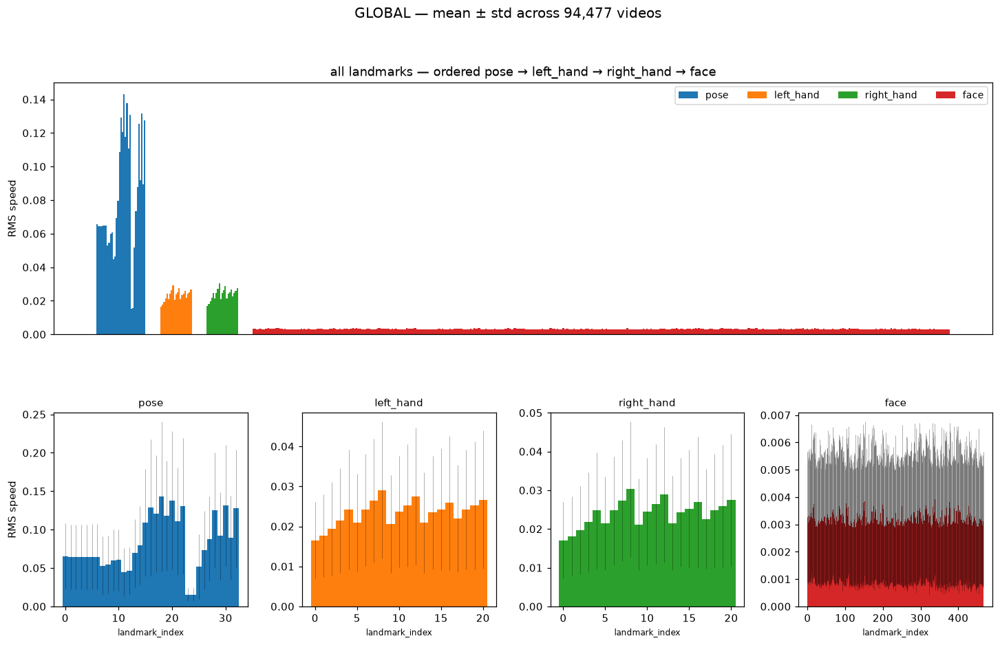
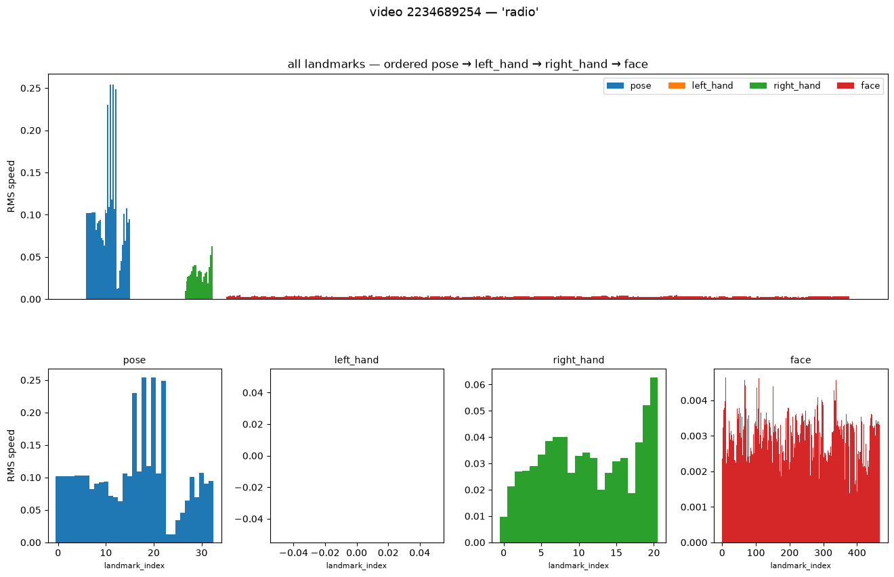
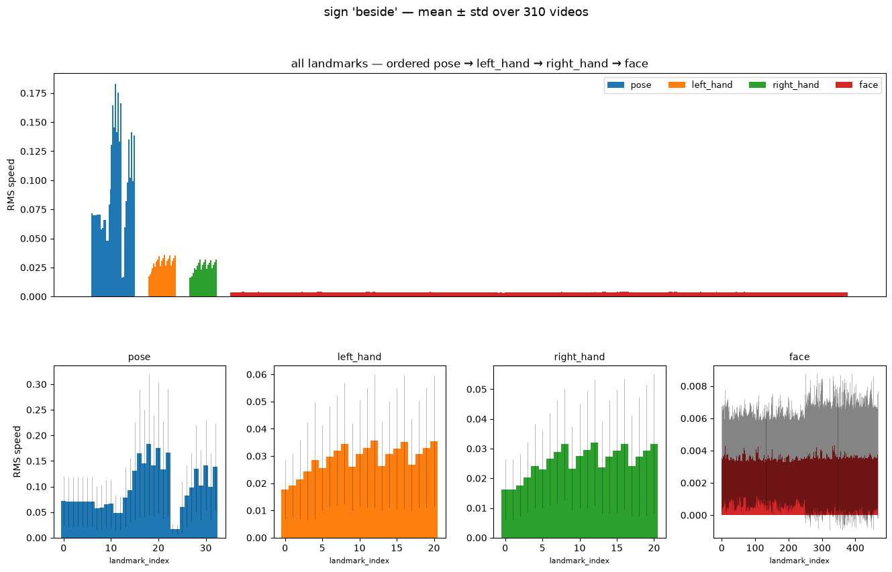
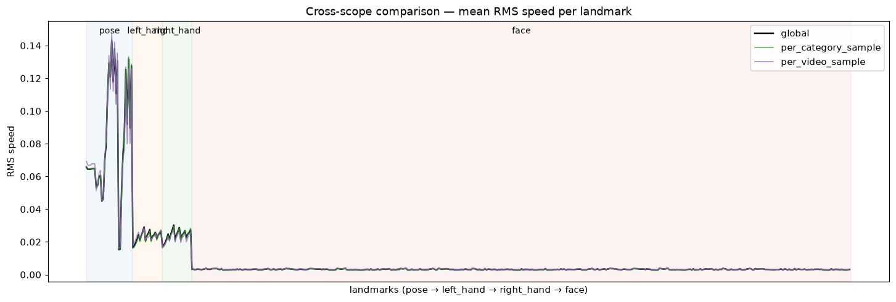
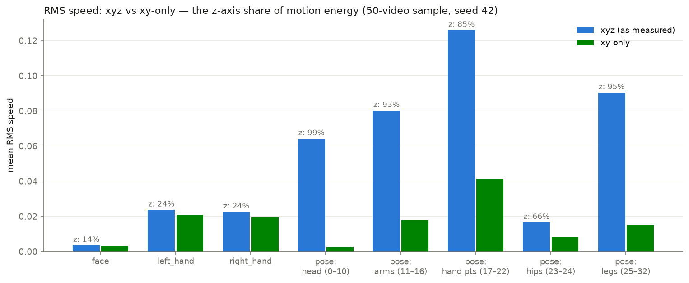

# GISLR landmark motion-energy analysis

**Status: complete.** All three scopes executed end to end, 0 failed units. This
report backfills the standalone write-up for a test that previously lived only
as a daily-log entry (TODO §0.5); the original narrative is
[docs/logs/daily/2026-07-15.md](../logs/daily/2026-07-15.md) Part I.

| | |
|---|---|
| **Question** | Which of the 543 MediaPipe Holistic landmarks actually move, and does that motion reproduce from a small sample — before GPU-hours are spent on models that ingest all of them? |
| **Instrument** | `src/gislr.0.dataset.motion-energy.ipynb` (TODO §1) |
| **Data** | GISLR (`asl-signs`): 94,477 videos, 250 signs, 21 participants, 543 landmarks/frame (468 face, 21 per hand, 33 pose), xyz |
| **Scopes** | per-video (50 seeded), per-category (10 seeded signs), global (all 94,477 videos, 189 resumable chunks) |
| **Metric** | per-landmark RMS speed (Savitzky-Golay smoothed, scored over raw-valid frame transitions only) |
| **Data** | `src/data/cache/gislr/motion_analysis/{per_video,per_category,global}/summary.parquet` |

This test measures *motion*, not *discriminativeness* — a landmark that moves
identically in every sign has high motion energy and zero class information.
It is deliberately the cheapest, model-free first pass; the follow-up
instrument that measures class information directly is
[subset-comparison.md](subset-comparison.md).

---

## 1. Method

Per-landmark **RMS speed**: pivot each video to frames × (landmark,
coordinate), reindex to a contiguous frame range, linear-interpolate gaps,
Savitzky-Golay smooth (window 7, polyorder 2), frame-to-frame displacement,
then `sqrt(mean(speed²))` over **valid transitions only** — a transition
counts toward a landmark's RMS only if that landmark was observed (non-NaN) at
both endpoints in the raw data, so a hand visible in 20% of frames is scored on
those frames rather than diluted toward stillness.

Loading goes through DuckDB (`load_landmarks_for_paths`, explicit parquet file
list) so only requested files are opened; full in-SQL aggregation was rejected
because Savitzky-Golay needs an ordered per-frame series, but the final global
aggregation runs in-SQL over cached per-chunk parquets. All three scopes share
one manifest-driven resumable loop (`process_units`): per-unit artifact
written before the unit is marked done, atomic manifest saves, `done` skipped
/ `failed` retried — it survived the full 189-chunk global run with 0
failures, at throughput ≈65 videos/s single-threaded (~25 min total).

## 2. Results

### 2.1 Global per-type picture (xyz, as measured)

| type | n landmarks | mean RMS | range | detected in % of videos |
|---|---|---|---|---|
| pose | 33 | 0.0827 | 0.0152 – 0.1431 | 100.0% |
| right_hand | 21 | 0.0241 | 0.0171 – 0.0303 | 54.7% |
| left_hand | 21 | 0.0233 | 0.0166 – 0.0291 | 41.4% |
| face | 468 | 0.0032 | 0.0029 – 0.0039 | 99.9% |

Within-type: fingertips move most (index > middle > pinky tip), wrist/thumb
base least — the expected articulation hierarchy. The right hand is detected
in 55% of videos vs 41% for the left (dominant-hand asymmetry). Pose's top
movers include real signal (wrist-adjacent points) but also **ankles/heels/feet**
— out of frame in seated signing, the first hint that raw xyz motion is
contaminated (§2.3). The face is nearly flat across all 468 landmarks
(0.0029–0.0039): it moves as a rigid object (head motion) with almost no
per-landmark differentiation, so motion energy alone cannot rank face
landmarks.

### 2.2 Do small seeded samples represent the global pattern?

Spearman rank correlation of per-landmark mean RMS against the full 94,477-video run:

| sample | rho vs global (n=543) |
|---|---|
| per-video (50 videos) | **0.954** |
| per-category (10 signs, ~3,750 videos) | **0.996** |

Small seeded samples reproduce the global per-landmark ranking almost
perfectly — the reason later landmark work (xy/xyz decomposition here,
[discriminability probes](subset-comparison.md)) could run on ~50-video
samples in minutes instead of a day-scale global pass.

### 2.3 How much of the "motion" is z-axis noise?

MediaPipe's z is known to be less reliable than x/y. Re-computing RMS speed on
the 50-video sample with xy only vs xyz:

| group | RMS (xyz) | RMS (xy) | z share of motion energy |
|---|---|---|---|
| face | 0.0035 | 0.0032 | 14% |
| left_hand | 0.0236 | 0.0210 | 24% |
| right_hand | 0.0224 | 0.0194 | 24% |
| pose: head (0–10) | 0.0642 | **0.0028** | **99%** |
| pose: arms (11–16) | 0.0801 | 0.0179 | 93% |
| pose: hand pts (17–22) | 0.1258 | 0.0412 | 85% |
| pose: hips (23–24) | 0.0165 | 0.0081 | 66% |
| pose: legs (25–32) | 0.0903 | 0.0150 | 95% |

**~92% of pose "motion energy" is z-axis noise** — pose-head landmarks are
essentially static in the image plane (xy RMS 0.0028, below face level); their
apparent 0.064 xyz motion was almost pure depth jitter. Same story for legs
(95% z). In honest xy terms the ranking becomes: pose hand points (0.041) >
hands (~0.020) ≈ pose arms (0.018) > legs > hips > face ≈ pose head. Hands
keep ~76% of their energy in xy (their motion is real); face keeps 86% but at
6× smaller magnitude. **Conclusion: raw xyz motion energy is not wrong but
misleading for pose — any landmark-importance decision must use xy or a
z-corrected metric.**

## 3. Landmark keep/discard recommendation

| group | count | verdict | rationale |
|---|---|---|---|
| left/right hand (all 21 each) | 42 | **keep** | primary articulators; highest genuine xy motion after pose hand pts |
| pose 11–16 (shoulders, elbows, wrists) | 6 | **keep** | genuine arm trajectory + 100% detection — the fallback signal when hands drop out |
| pose 23–24 (hips) | 2 | **keep** (cheap anchor) | stillest points measured; useful normalization anchor |
| pose 17–22 (wrist-adjacent) | 6 | optional | duplicates the hand meshes when present |
| face: lips | 40 | **keep** (not on motion grounds) | flat motion profile — kept for linguistic reasons (mouthing) |
| face: eyes + nose | 36 | keep (small) | near-rigid — head-pose anchor + non-manual cues |
| pose 0–10 (face duplicates) | 11 | **discard** | 99% z-noise, xy-static, redundant with face mesh |
| pose 25–32 (legs, feet) | 8 | **discard** | out of frame; apparent motion is jitter |
| face: everything else | 392 | **discard** | rigid head motion duplicated 392×; no per-landmark differentiation |
| z coordinate (all kept landmarks) | — | **discard** | 92% of pose energy is z-noise; even hands keep only a noisy 24% |

Keeping every "keep" row = **126 landmarks (ME-126)**; the strict
1st-place-compatible variant without pose = 118 (**FP-118**).

### Cross-check against the Kaggle GISLR 1st-place solution

The 1st-place entry (`src/gislr.0.competition.entry.1st.ipynb`, hoyso48; CV
0.80 / public LB 0.80 / private LB 0.88) keeps 118 landmarks × xy = 236 of
1,629 raw values/frame (14.5%) — no external data, trained from scratch on the
full competition set.

| decision | motion-energy (xy) verdict | 1st place | agreement |
|---|---|---|---|
| keep both full hands | keep | keep | agree |
| discard 392 of 468 face landmarks | discard | discard | agree |
| discard pose legs + face-duplicate pose head | discard | discard | agree |
| discard z | discard | discard | agree |
| upper-body pose (11–16, 23–24) | **keep** | **drop** (drafted, commented out) | diverges |
| lips / eyes / nose | flat 0.003 band, nothing special | **keep** (mouthing & non-manual markers) | diverges |

Both divergences are the expected blind spots of a motion-only instrument: it
over-values redundant motion (pose arms move genuinely but may be recoverable
from hand position alone) and under-values low-motion, high-information
articulators (lips barely move but carry mouthing). **Motion energy agrees
with ~110 of the 118 kept landmarks and every wholesale discard, but cannot by
itself adjudicate pose or justify keeping lips/eyes** — that required the
follow-up discriminability instrument (see [subset-comparison.md](subset-comparison.md)),
which confirmed ME-126 (adjudicating pose in its favor) and separately
verified the ME-126 GRU beats the full-543 baseline 73.73% vs 70.59% at half
the parameters.

## 4. Follow-ups

- [ ] Global xy-only re-aggregation of the motion-energy summaries (z-noise
  correction at full-dataset scale) — TODO §1.8.
- [x] Within-class consistency + cross-class discriminability — delivered as
  [subset-comparison.md](subset-comparison.md).
- [ ] Re-run motion energy on normalized coordinates once TODO §7.2
  normalization lands — un-normalized motion may be biased by signer scale
  (TODO §7.7).

*Report backfilled 2026-07-22 from `docs/logs/daily/2026-07-15.md` (test executed 2026-07-15, seed 42).*
