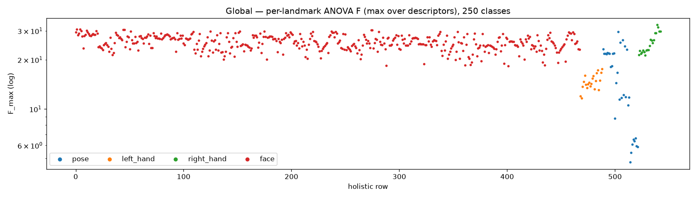
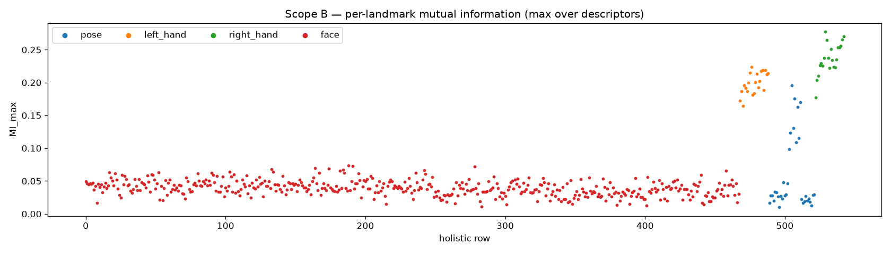
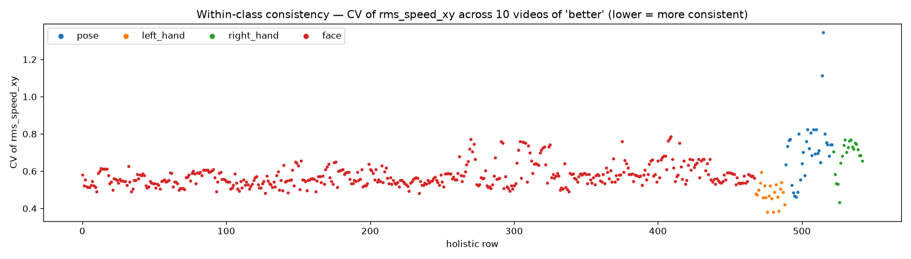

# Landmark-subset discriminability comparison

**Status: complete.** All three scopes executed end to end. This report
backfills the standalone write-up for a test that previously lived only as a
daily-log entry (TODO §0.5); the original narrative is
[docs/logs/daily/2026-07-16.md](../logs/daily/2026-07-16.md) Part I.

| | |
|---|---|
| **Question** | Which landmark subset carries the most class information — as opposed to which moves the most (see [motion-energy.md](motion-energy.md))? |
| **Instrument** | `src/gislr.0.dataset.subset-comparison.ipynb` (TODO §3.0) |
| **Subjects** | every subset in `src/modules/dataset/landmark/subsets.py`: FULL_543, FP_118 (1st-place), ME_126, ME_132, HANDS_42, HANDS_POSE_50 |
| **Scopes** | A: 10 videos of one class (within-class consistency) · B: 10 sampled signs, 3,672 videos · C: global, all 94,477 videos / 250 classes, 189 resumable chunks |
| **Split** | probe uses the canonical stratified 90/10 split, seed 42, 9,448 val — the same split every GRU run uses |
| **Data** | `src/data/cache/gislr/subset_comparison/{leaderboard.csv, scope_{b,c}_landmark_scores.parquet, scope_c_per_class/<subset>.csv}` |

## 1. Why motion energy wasn't enough

The 2026-07-15 motion-energy analysis ranked landmarks by how much they
*move*; its predicted blind spots were over-valuing redundant motion and
missing low-motion, high-information articulators (lips sit in a flat 0.003
RMS band). This analysis measures discriminability directly, and the two
rankings turned out to be **essentially uncorrelated (Spearman rho = −0.12,
n = 543, global scope)** — motion and class information are different
quantities, and subset decisions must use the latter.

## 2. Method

Per-video, per-landmark descriptors (xy only — z is ~92% noise for pose, per
motion-energy §2.3): `rms_speed_xy` (same Savitzky-Golay recipe as
motion-energy), `x_mean`, `y_mean`, `x_std`, `y_std`, `detection_rate`. NaN→0
after tensor assembly, matching the training NaN policy.

| instrument | level | what it measures |
|---|---|---|
| within-class consistency | landmark | CV of `rms_speed_xy` + positional spread within one class |
| ANOVA F-ratio (`f_classif`) | landmark | between/within-class variance per descriptor; landmark score = max over its 6 descriptors |
| mutual information | landmark | non-linear descriptor↔label dependence (10-class scope only) |
| **probe classifier** | **subset** | multinomial logistic regression on the subset's flattened descriptors — **the headline subset score** |

The probe sees summary statistics, not trajectories, so it ranks *input
information content*, not achievable model accuracy — only its ordering
across subsets is meaningful, but because it runs on the canonical split its
numbers are directly comparable to every GRU run's val accuracy.

## 3. Results

### 3.1 The leaderboard — global probe, 250 classes

| subset | landmarks | **probe acc (global)** | macro | probe acc (10-class) | median F (global) |
|---|---|---|---|---|---|
| **ME_126** | 126 | **49.9%** | **49.7%** | 80.7% | 24.5 |
| ME_132 | 132 | 49.8% | 49.5% | 81.0% | 24.4 |
| FP_118 (1st place) | 118 | 48.6% | 48.4% | 81.0% | 24.5 |
| HANDS_POSE_50 | 50 | 46.7% | 46.5% | 79.4% | 17.0 |
| HANDS_42 | 42 | 43.7% | 43.5% | 80.7% | 19.4 |
| FULL_543 | 543 | 40.6% | 40.4% | 77.7% | 25.1 |

- **ME_126 > FP_118 (+1.3 pts): upper-body pose {11–16, 23–24} adds real
  information** beyond the 1st-place 118 — adjudicating the one divergence
  from the motion-energy cross-check in favor of keeping pose, consistent
  with the trained GRU result (ME-126 +3.14 over the full-543 baseline).
- **ME_132 ≈ ME_126 (−0.2 pts): pose wrist points {17–22} add nothing** once
  hands and arms are already in — ME_126 stays the recommended subset.
- **Face is worth ~3 pts** (HANDS_POSE_50 46.7% → ME_126 49.9%) and hands
  alone lose ~6 pts to ME_126; at only 10 classes hands alone nearly match
  everything, so face/pose contributions only become visible once class count
  stresses fine distinctions.
- **FULL_543 is dead last (40.6%)** despite the *highest* median per-landmark
  F (25.1) — 417 individually-informative-but-redundant landmarks actively
  hurt the joint model. The probe reproduces the trained-GRU finding
  (70.59% full vs 73.73% ME-126) purely from input statistics, with no
  training required.

### 3.2 Per-landmark picture: redundancy is the story

Per-landmark F at 250 classes is high across the *whole face* (median 25.7 —
the highest type), because head pose/motion is itself class-informative and
every one of ~400 face landmarks carries that same rigid signal. Lips (26.8)
barely edge out the rest of the face (25.8): **marginal F cannot rank face
landmarks either** — what it shows is that hundreds of face points duplicate
one head-pose signal. The subset-level probe is the instrument that correctly
prices that redundancy (FULL_543 last; the 36-point eyes/nose anchor is
enough).

Other findings:

- **`x_std` is the most discriminative descriptor** (median F 25.1), ahead of
  `rms_speed_xy` (17.3) — *where* a landmark ranges horizontally separates
  signs better than *how fast* it moves; `x_mean` is nearly useless (F 1.0,
  absolute position is signer-dependent).
- Per-landmark rankings are **class-set dependent**: F ranks from the 10-class
  scope correlate only moderately with global (rho 0.51) — unlike motion
  energy, which was stable at rho 0.95+. Discriminability analyses must run
  at the target class count.
- F vs MI agreement at 10 classes: rho 0.52 — MI favors hands (non-linear
  signal), F spreads credit onto the face.

### 3.3 External validation & hard classes

Probe per-class recall (ME_126) vs the trained ME-126 GRU's per-class
accuracy: **Spearman rho = 0.640 (n = 250)** — the probe's difficulty profile
tracks the real model's, lending credibility to the leaderboard beyond the
probe's own terms. Probe-hardest classes under ME_126 (`after, cereal, go,
there, pen, nap, beside, garbage, give, snack`) overlap heavily with the
trained GRU's worst classes (`there`, `nap`, `beside`, `give`) — evidence
these are genuinely confusable signs rather than representation artifacts.

### 3.4 Within-class consistency (context only)

Across 10 videos of one class (`'better'`), hands are the most repeatable
movers (median speed-CV: HANDS_42 0.54 vs FULL_543 0.56), but the candidate
subsets sit in a narrow 0.58 band at n=10/1 class — consistency did not
meaningfully differentiate the subsets on its own; kept as a direction check,
not a decision input.

## 4. Verdict

**ME-126 is confirmed as the project's landmark subset by three independent
lines of evidence**: motion-energy keep/discard logic, the trained GRU
ablation (+3.14 pts over full-543), and this input-information probe (best of
6 subsets, +1.3 over the 1st-place FP-118). Scores are recorded in the
registry (`SUBSETS[...].probe_acc_global`).

## 5. Follow-ups

- [ ] FP_118 / ME_132 training ablations — the probe's predictions about pose
  and pose-wrist points need a trained-model confirmation (TODO §3.1).
- [ ] xy-only ablation (drop z) — motivated by `x_std` dominance; causal
  running-std features are streamable and worth their own ablation.
- [ ] Face-anchor reduction (eyes/nose 36 → ~8 rigid anchors) — candidate new
  subset, needs a trained ablation before registry admission.

*Report backfilled 2026-07-22 from `docs/logs/daily/2026-07-16.md` (test executed 2026-07-16, seed 42).*
