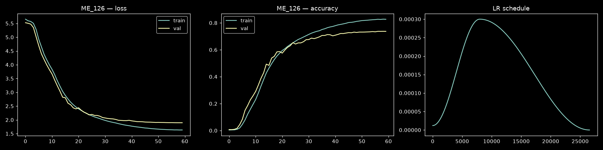

# StreamingGRU — ME_126 subset (20260716-213901)

> Draft auto-generated by `gislr.1.model.gru.ipynb` (section 7).
> Finalize after running the canonical per-class eval below.

## Training conditions

- architecture: StreamingGRU (unidirectional/causal GRU, hidden 256 x 2 layers,
  LayerNorm in/out, dropout 0.3) — 948,718 params
- input: ME_126 (126 landmarks) x xyz = 378 features/frame
- hyperparameters (identical to the 20260713-213000 full-543 baseline; the
  landmark subset is the only variable): batch 192, lr 0.0003
  (OneCycleLR), weight decay 0.0001, 60 epochs,
  grad-clip 5.0, CE + label smoothing 0.1, AMP, seed 42,
  max_seq_len 128, num_workers 0 (in-RAM cache)
- data: see [data.md](data.md)

## Results (training loop)

- best val accuracy: **0.7373** (60/60 epochs)
- references: FULL_543 baseline 70.59% (20260713-213000) · ME_126 73.73% (20260715-190729)



## Canonical per-class evaluation — PENDING

Run from the repo root:

```bash
.venv/Scripts/python.exe scripts/eval_gru.py src/models/gislr/gru/20260716-213901/gru_best.pt src/models/gislr/gru/20260716-213901 --landmarks src/models/gislr/gru/20260716-213901/cache/landmarks.npy
```

Then record overall/macro accuracy + per-class artifacts here and update the
leaderboard in `src/models/README.md` (displacement requires this exact
split/metric).
